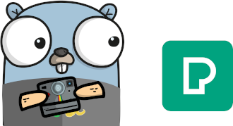

# Gopexels

A fast image/video downloader from Pexels.com written in Golang


&nbsp;




[](https://goreportcard.com/report/github.com/schlunsen/gopexels)


# Make it happen


1. **Build**

```shell script
make 
```

2. **Init with API KEY**

```shell script
gopexels init # Enter you key in the CLI
```

3. **Run**

```shell script
gopexels --threads 10 SEARCH_QUERY 
```

3. **Run Photo Frame**
Starts a REST api and a webview with a slideshow of photos
```shell script
gopexels photoframe SEARCH_QUERY
```

4. **Test**

```shell script
go test -v ./tests/*
```

_______
